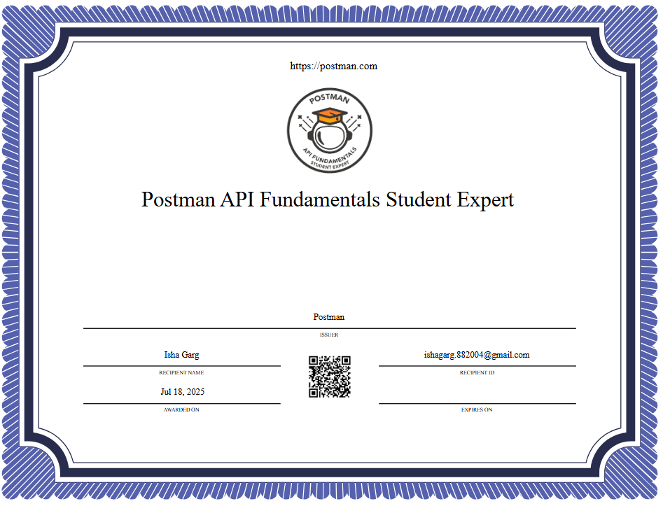

# 📜 Certifications

## 🔹 Postman API Fundamentals Expert - Student

**Platform**: Postman Academy  
**Completed**: [18-07-2025]  
**Certificate**: [View Certificate](https://drive.google.com/file/d/1ZgotN3sczR07G359XjgQdGb6P8nYTkEQ/view?usp=drive_link)

### ✅ What I Learned:
- Creating and testing **GET, POST, PATCH, DELETE** requests
- Using **query parameters**, headers, request **bodies**
- Understanding **status codes** and response types
- Implementing **authorization** (API keys, tokens)
- Writing **Pre-request scripts** and **Tests**
- Using **Postman Collection Runner** for automation
- Real-time API testing and completing task-based challenges

---
 <!-- Optional: Show image -->

 <!-- Optional: Show image -->
